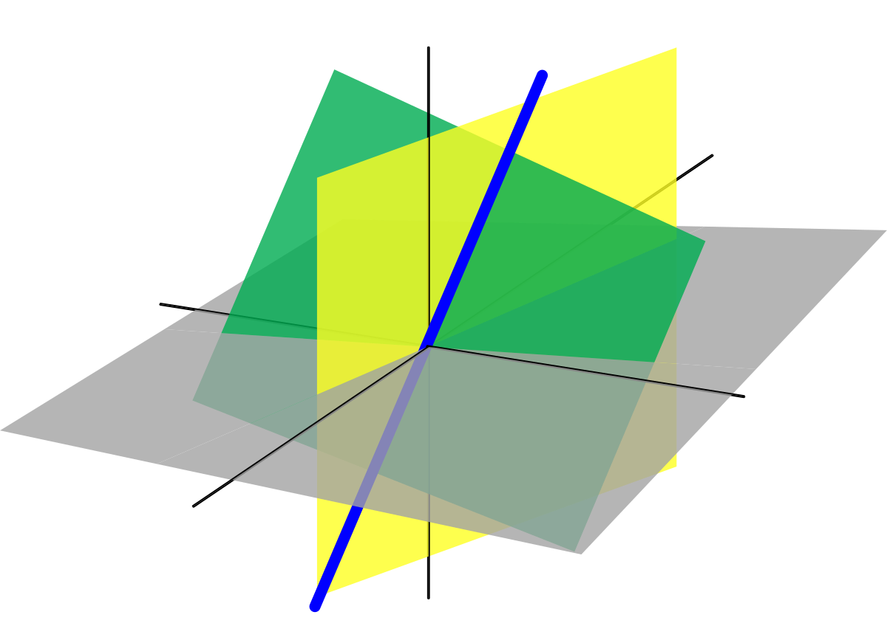

# Go-LinAlg

-----------------------------------------------------------------------------------------------------

-----------------------------------------------------------------------------------------------------

Go-LinAlg (GLA) is an open source numerical computation and linear algebra library for the Go Programming Language. It is designed to be easy to use and to be as efficient as possible. Many of the Concepts and Functions in this library are based on the [NumPy](https://numpy.org/) library for Python.

    A := Range_Tensor([]int{4, 5, 12}, true) // batch of 4 tensors of shape [5, 12]
    AxA := MatMul(A, A, true)                // <--- batched matmul 

# Setup
-----------------------------------------------------------------------------------------------------

To set up this use this package in your own project, first install the package using the following command:

    go get github.com/Holindauer/Go-LinAlg

Then import the package into your project:

    import . "github.com/Holindauer/Go-LinAlg/GLA"

Don't forget the . before the import statement. This allows you to call the functions and methods in this package without having to specify the package name.

# Documentation
-----------------------------------------------------------------------------------------------------

The documentation for this library can be found here: [GLA Doc](documentation.md).

# Contributing
-----------------------------------------------------------------------------------------------------

If you would like to contriibute to this poroject, take on an issue and submit a pull request. If you would like to add a new feature, please open an issue first to discuss the feature you would like to add. 

The two most import rules are: 

    1: All changes must pass testing 
    2: Reduce code duplication as much as possible

For more information on the contribution procedure and coding standards, please visit our [Contribution Guidelines](CONTRIBUTING.md) 

